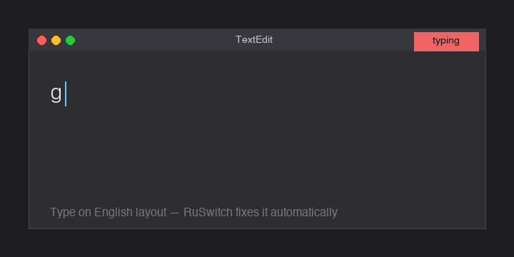

# Bzz

[](https://golang.org)
[](LICENSE)
[](https://www.apple.com/macos/)
[](#building-from-source)

Automatic keyboard layout switcher for macOS. Types "ghbdtn" in QWERTY by mistake? Bzz instantly converts it to "привет" before you hit Enter.



> **Bzz is the open-source MIT alternative to Caramba Switcher** for macOS users who need automatic Cyrillic↔Latin layout switching — a 98K-word morphological dictionary, on-device only (no telemetry), and a one-time 490 ₽ price for Pro features instead of a yearly subscription. It also fills the gap left by Punto Switcher, which has been abandoned for macOS since 2017.

## Changes in this fork

This fork ([scorpionishe/bzz](https://github.com/scorpionishe/bzz)) makes Bzz **layout-neutral** and hardens the manual hotkey:

- **Never switches your system input source.** Upstream cycled the active macOS layout to the *next* source after every correction. That "wandered" across mixed-language sentences and broke whenever you have more than two selectable sources (e.g. ABC + Russian + the Character Viewer), landing on the wrong layout and garbling every other word. This fork only rewrites the *text* in place — for both auto-correction and the `Cmd+Shift+X` manual hotkey — and leaves the active layout alone (classic Punto-style behavior). You keep typing in one layout; Bzz just fixes the words.
- **Hardened `Cmd+Shift+X`.** It releases stuck modifiers before and after the conversion, so a *synthetic* hotkey (e.g. one remapped from Caps Lock via Karabiner) can no longer leak `Shift` into the internal `Cmd+C` (the "no selection detected" failure) or leave `Cmd` logically held, which used to turn your next Space into `Cmd+Space` (Spotlight). It also clears the auto-correction buffer when triggered, so the following space can't re-fire on the stale keystrokes and double-convert (`привет` → `привета`).
- **Configurable hotkey** (`hotkey:` in config) plus smarter trailing punctuation. The manual-convert shortcut can be any combo or a single key like `f18`; mapping a Caps Lock tap to `f18` drops the stray-`x`/modifier leaks entirely. Trailing punctuation that doubles as a Russian letter (`. = ю`, `, = б`) is kept as punctuation when the word is otherwise valid — `ltkf,` → `дела,`, `gtxfnf.` → `печатаю`, `ghbdtn.` → `привет` — in both auto and manual paths.

### New in v0.6.1

- **Fixed the silent random quits.** Bzz occasionally vanished from the menu bar with no error and no crash report. The cause: the TIS input-source API (`TISCopyCurrentKeyboardInputSource` / `TISSelectInputSource`) is main-thread-only on modern macOS — its lazy cache-refresh paths assert the main dispatch queue and abort the process when hit from another thread ("BUG IN CLIENT OF LIBDISPATCH"). Bzz queried it from the event-tap thread on every word boundary. The active-layout check now reads an atomic cache refreshed on the main thread by the existing layout-change observer, and layout switching hops to the main queue.

### New in v0.5

- **Manual flips for Russian-layout symbols** (via the convert hotkey — CAPS/`f18` or `Cmd+Shift+X`): `№` → `#`, `;` → `*`, `]` → `` ` ``. These are positional flips of the macOS "Russian" layout: `Shift+3` gives `№` where EN has `#`, `Shift+8` gives `;` where EN has `*`, and the key left of `1` gives `]` where EN has `` ` ``. Bzz tells a `;` typed as `Shift+8` on the Russian layout apart from a `;` typed on the semicolon key in EN (and likewise `]` from the grave key vs the `ъ` key) by the physical keycode, so the old letter flips (`;` → `ж`, `]` → `ъ`) keep working exactly as before. `№` also counts as Russian-layout evidence in selections — select `№5`, hit the hotkey, get `#5`.

### New in v0.4

- **Shortcut keystrokes no longer pollute the word buffer.** A stray `c`/`v` from `Cmd+C`/`Cmd+V` used to linger in the buffer and get "corrected" at the next boundary — paste a value into a rename field, press Enter, and it turned into `с`. Any keystroke with `Cmd`/`Ctrl` held now clears the buffer and passes through.
- **Abbreviation dictionary.** Russian abbreviations typed on QWERTY convert with the dots preserved: `n.l.` → `т.д.` (plus `т.п. т.е. т.к. др. пр.`). Handled before the URL/two-dot skip heuristic, on both the space and Enter paths.
- **Context-aware detection** (`context_aware`, on by default). Recent-word language context plus an *impossible-in-English* trigram check (with Russian-plausibility gating) catches short wrong-layout fragments that aren't in the dictionary — e.g. `ddj` → `вво`.
- **Optional layout-switch mode** (`switch_layout`, off by default). When on, a correction also moves the macOS input source to match (classic Punto "switch"), targeting the layout directly instead of the old buggy cycle. Off = layout-neutral (default).
- **Flag tray icon + settings submenu.** The menu-bar glyph shows the active layout (🇷🇺 / 🇬🇧, 💤 when paused) and updates live on layout change. The tray menu has toggles for *Switch layout* / *Context-aware* and a *"Don't correct: <app>"* item that adds/removes the frontmost app from `excluded_apps`.

See the fork's commit history on the `main` branch. The build is ad-hoc signed (not notarized) — see [Installation](#installation) for the Gatekeeper/quarantine step.

## Features

- **Instant auto-correction**: Detects wrong keyboard layout and fixes on the fly
- **Smart dictionary**: 98K Russian words with Snowball stemmer for accurate detection
- **Fuzzy matching**: Catches typos within 1 character edit distance
- **Context-aware**: Recent-word context + impossible-in-English combo detection (`ddj` → `вво`), plus Russian/English guards to avoid false positives
- **Abbreviations**: `n.l.` → `т.д.` and friends, with dots preserved
- **Russian-symbol flips**: `№` → `#`, `;` → `*`, `]` → `` ` `` on the manual hotkey, keycode-aware so EN-typed `;`/`]` still flip to `ж`/`ъ`
- **Undo in 5 seconds**: Cmd+Z to revert the last correction
- **Optional layout-switch mode**: also switch the system input source on a correction (`switch_layout`), or stay layout-neutral (default)
- **Flag tray icon**: shows the active layout (🇷🇺 / 🇬🇧, 💤 paused); toggles + per-app exclusions live in the tray menu
- **Auto-start**: Launches automatically at login via LaunchAgent
- **Lightweight**: universal (arm64 + Intel) ~4 MB binary, minimal CPU usage

## Requirements

- **macOS 10.15+**
- **Accessibility permission** (required for keyboard interception)

Windows support is planned.

## Installation

### Download Pre-built Binary (Recommended)

1. Download the latest `.dmg` from [Releases](https://github.com/scorpionishe/bzz/releases) (universal — Apple Silicon + Intel)
2. Open the DMG and drag **Bzz** to Applications
3. **Clear the Gatekeeper quarantine** (the build is ad-hoc signed, not notarized, so this one-time step is required):
   ```bash
   xattr -dr com.apple.quarantine /Applications/Bzz.app
   ```
   Or via GUI: **System Settings → Privacy & Security** → scroll to the "Bzz was blocked…" row → **Open Anyway**.
4. Launch Bzz, then grant **Accessibility**: macOS prompts for **System Settings → Privacy & Security → Accessibility** — enable Bzz (add `/Applications/Bzz.app` with `+` if it's not listed) and relaunch.

### Build from Source

**Requirements**: Go 1.26+ and `make`

```bash
git clone https://github.com/scorpionishe/bzz.git
cd bzz
make app             # Creates Bzz.app in ./build/
make install         # Copies to ~/Applications/
make dmg-universal   # Universal (arm64 + Intel) DMG for distribution
```

Or build the binary only:

```bash
go build -ldflags="-s -w" -o Bzz .
./Bzz
```

## First Run

1. **Grant Accessibility permission**:
   - Go to **System Settings → Privacy & Security → Accessibility**
   - Add Bzz to the allowed apps list
   - Restart Bzz if needed

2. **Configure (optional)**:
   - Bzz creates `~/Library/Application Support/Bzz/config.yaml` on first run
   - Default settings work for most users — no action required

3. **Check tray icon**:
   - Look for the Bzz icon in the menu bar (top-right corner)
   - Flag of the active layout (🇷🇺 / 🇬🇧) = active, 💤 = paused

## Usage

### Automatic Correction

Just type normally. Bzz watches for wrong keyboard layout:

```
Type: ghbdtn [Space]     → Auto-corrects to: привет
Type: GHBDTN [Space]     → Auto-corrects to: ПРИВЕТ
Type: Lfvecz, [Enter]    → Auto-corrects to: Привет, [then submits]
```

**When does it correct?**
- When you press Space, Enter, or punctuation (. , ! ? ; : ' ")
- If the word is in the Russian dictionary
- Or within 1 typo of a known Russian word (6+ characters)

### Undo

Press **Cmd+Z** within **5 seconds** of a correction to revert:

```
ghbdtn [Space] → привет
[Cmd+Z]        → ghbdtn (reverted)
```

The undo window closes after 5 seconds or if you type something else.

### Pause/Resume

Click the tray icon to toggle:
- **🇷🇺 / 🇬🇧 Active** (flag of the current layout)
- **💤 Paused** (Bzz is disabled)

The tray menu also has *Switch layout* / *Context-aware* toggles and a
*"Don't correct: <app>"* item for per-app exclusions. Or quit from there.

## Configuration

Edit `~/Library/Application Support/Bzz/config.yaml`:

```yaml
enabled: true                    # Enable/disable the app
primary_language: ru             # Primary language (ru or en)
min_word_length: 2               # Minimum word length to check
hotkey: f18                      # Manual-convert hotkey (default; needs Karabiner Caps→f18, else use cmd+shift+x)
switch_layout: false             # true = also switch the macOS input source on a correction (Punto "switch" mode)
context_aware: true              # recent-word context + impossible-in-English combo detection (e.g. "ddj" → "вво")
excluded_apps:                   # Apps where Bzz is disabled (substring match on bundle id)
  - idea                         # Example: JetBrains IDEs
```

`switch_layout` and `context_aware` are also toggled from the tray settings, and
the tray's "Не исправлять: <app>" item adds/removes the frontmost app here.

`hotkey` (this fork) sets the manual selection-convert shortcut. It accepts
modifier combos (`cmd+shift+x`, `ctrl+space`) or a single key (`f18`).
Mapping it to a dedicated key like `f18` — emitted from a Caps Lock tap via
Karabiner — avoids the stray character/modifier leaks of `cmd+shift+x`.

Changes take effect immediately — no restart needed.

## Architecture

### Core Components

- **Hook** (`hook_darwin.go`): CGEventTap intercepts keyboard events in real-time
- **Detector** (`detector.go`): Analyzes text to determine if layout switch occurred
- **Dictionary** (`dict.go`): 98K Russian words + Snowball stemmer for lemmatization
- **Replacer** (`replacer_darwin.go`): Sends backspace/character events to fix text
- **Tray** (`tray_darwin.go`): System menu bar integration for pause/resume
- **Buffer** (`buffer.go`): Accumulates characters to form words at phrase boundaries

### Detection Algorithm

1. **Script detection**: Identifies if text is Latin or Cyrillic
2. **Dictionary lookup**: Checks if the converted word exists in Russian dictionary
3. **Stem matching**: Uses Snowball stemmer for verb/noun variations
4. **Fuzzy matching**: For 6+ character words, finds corrections within 1 edit distance (Levenshtein)
5. **Context tracking**: Remembers recent language to avoid false positives
6. **Trailing punctuation**: Handles mixed QWERTY/Russian punctuation correctly

### Example Detection

```
Input:      "ghbdtn"
Convert:    "привет" (QWERTY → Russian keymap)
Lookup:     ✓ Found in dictionary
Result:     Correct to "привет"

Input:      "ghbdtna" (typo: extra 'a')
Convert:    "приветf" 
Fuzzy:      Within 1 edit of "приветф" or "привет"?
Result:     Correct to "привет"
```

## Building from Source

### macOS Binary

```bash
go build -ldflags="-s -w" -o Bzz .
```

### macOS App Bundle

```bash
make app      # Creates Bzz.app with icon
```

### macOS Installer (DMG)

```bash
make dmg      # Creates Bzz.dmg
```

### Windows Executable (Cross-compile from macOS)

Windows support requires MinGW on macOS:

```bash
brew install mingw-w64
make build-windows
```

Creates `Bzz.exe`.

### Release Artifacts

```bash
make release  # Builds both macOS .dmg and Windows .exe
```

## Testing

Run the test suite:

```bash
go test ./... -v
```

Key tests:
- `detect_test.go`: Dictionary lookup and fuzzy matching logic
- `shifted_test.go`: Shifted key handling (Caps Lock, numbers)
- `integration_test.go`: End-to-end behavior with buffer

## Contributing

Bzz is open-source under the MIT license. Contributions welcome!

### Adding Support for Other Languages

1. Add a dictionary file to `dicts/<lang>_freq.txt` (one word per line)
2. Add stemmer support in `dict.go` if available
3. Update keymap in `keymap.go` for the target language
4. Test with `detect_test.go`

### Improving Russian Dictionary

The dictionary at `dicts/ru_freq.txt` is frequency-ranked. To improve:

- Submit PRs with additional common Russian words
- Include frequency data if available
- Test with real-world usage patterns

## Architecture Decisions

- **CGEventTap**: Chosen over Quartz Event Services for consistent, low-latency event interception
- **Snowball Stemmer**: Preferred over hand-written rules for Russian morphology
- **Active undo (5s window)**: Short enough to not interfere with typing, long enough for reflexive corrections
- **Exact EN match**: Prevents "if", "the", "and" from being corrected when typed on Russian layout
- **Lightweight dictionary**: Embedded (no network calls), fast in-memory lookup with 98K words covering 99% of common Russian

## Open Core Model

Bzz core is free under the MIT License — forever. This includes auto-correction,
fuzzy matching, Cmd+Z undo with per-app learning, Cmd+Shift+X manual selection
conversion, tray icon, LaunchAgent auto-start, and per-app exclusions via
config.yaml. None of these will ever move to a paid tier.

**Bzz Pro (v0.4, planned Q3 2026)** — one-time 490 ₽ purchase, lifetime:

1. **Custom Dictionary** — add your own terms, client names, professional jargon
   the auto-corrector should respect
2. **Additional layouts** — Ukrainian, Kazakh, Belarusian, German, French
   (one included in Pro, others +200 ₽ upgrade)
3. **Per-app exception UI** — graphical management of the rules Cmd+Z learns

See [marketing/PRO_FEATURES.md](marketing/PRO_FEATURES.md) for the canonical
list and rationale. Pro will be sold through a Telegram bot with offline
Ed25519-signed license files — no servers, no telemetry, no recurring charges.

Until Pro ships, you can support development via Boosty / GitHub Sponsors
(TBA) — supporters do not get extra features (so we stay honest about
what Pro will be).

## Privacy

Bzz processes keystrokes locally only. There is no HTTP client in the
binary — `grep -rE "net/http|net.Dial" *.go` returns nothing. Read the
full [Privacy Policy](https://zlopixatel.github.io/bzz/privacy.html).

## Troubleshooting

### "Bzz cannot be opened" (Gatekeeper)

```bash
xattr -d com.apple.quarantine /Applications/Bzz.app
open /Applications/Bzz.app
```

Or: Right-click Bzz.app → Open Anyway

### Accessibility permission not working

1. Go to **System Settings → Privacy & Security → Accessibility**
2. Remove Bzz if listed
3. Restart Bzz — it will re-request permission
4. Grant access and restart

### Corrections not happening

- Check the tray icon (is it ⚡ or 💤)?
- Verify Accessibility permission is granted
- Check system logs: `log stream | grep Bzz`
- Ensure your keyboard layout is set to Russian (Cmd+Space to switch)

### Performance or crashes

- Check `~/Library/Application Support/Bzz/config.yaml` for typos
- Try resetting config: Delete the file and restart (defaults will be recreated)
- Report issues with system details at [GitHub Issues](https://github.com/scorpionishe/bzz/issues)

## License

MIT License — see [LICENSE](LICENSE) for details.

Copyright © 2026 Roman Kovalev

## Competitors

- **Caramba Switcher**: Closed-source, subscription model ($29.99/year)
- **Punto Switcher**: Legacy Windows-first design, limited macOS support
- **Bzz**: Free, open-source, macOS-native

---

## Русский / Russian

### О проекте

**Bzz** — автоматический переключатель раскладки клавиатуры для macOS. Типите "ghbdtn" вместо "привет"? Bzz исправит это прямо при вводе.

### Отличия этого форка

Этот форк ([scorpionishe/bzz](https://github.com/scorpionishe/bzz)) делает Bzz **нейтральным к раскладке** и укрепляет ручной хоткей:

- **Не переключает системную раскладку.** В апстриме после каждой коррекции активный язык ввода щёлкался «на следующий», из-за чего раскладка «гуляла» по смешанной фразе и ломалась при >2 источниках (например ABC + Russian + Character Viewer) — попадала не туда и портила каждое второе слово. Здесь Bzz правит только *текст* на месте (и в авто-коррекции, и в ручном `Cmd+Shift+X`), а раскладку не трогает — как классический Punto. Печатаешь в одной раскладке, Bzz просто чинит слова.
- **Укреплён `Cmd+Shift+X`.** Сбрасывает залипшие модификаторы до и после конвертации: *синтетический* хоткей (например переназначенный с Caps Lock через Karabiner) больше не «протекает» `Shift`'ом во внутренний `Cmd+C` (ошибка «no selection detected») и не оставляет зажатым `Cmd` (из-за чего следующий пробел превращался в `Cmd+Space`/Spotlight). Плюс очищает буфер авто-коррекции при срабатывании, чтобы пробел после не сработал по устаревшим буквам и не давал двойную конвертацию (`привет` → `привета`).
- **Настраиваемый хоткей** (`hotkey:` в конфиге) и умная хвостовая пунктуация. Хоткей ручной конвертации — любое комбо или одиночная клавиша вроде `f18`; тап Caps Lock на `f18` полностью убирает протечки буквы `x`/модификаторов. Хвостовой знак, совпадающий с русской буквой (`. = ю`, `, = б`), остаётся пунктуацией, когда слово в остальном валидно — `ltkf,` → `дела,`, `gtxfnf.` → `печатаю`, `ghbdtn.` → `привет` — и в авто, и в ручном пути.

#### Новое в v0.4

- **Клавиши-шорткаты больше не засоряют буфер слова.** Паразитный `c`/`v` от `Cmd+C`/`Cmd+V` зависал в буфере и «исправлялся» на следующей границе — вставляешь значение в поле переименования, жмёшь Enter, и оно превращалось в `с`. Теперь любое нажатие с зажатым `Cmd`/`Ctrl` чистит буфер и проходит насквозь.
- **Справочник аббревиатур.** Русские сокращения, набранные на QWERTY, конвертятся с сохранением точек: `n.l.` → `т.д.` (плюс `т.п. т.е. т.к. др. пр.`). Обрабатывается до эвристики «URL/две точки», и в пробельном, и в Enter-пути.
- **Контекстное определение** (`context_aware`, по умолчанию вкл). Язык предыдущих слов + проверка «невозможных для английского» триграмм (с гейтом на плаусибельность русского) ловит короткие фрагменты не из словаря — например `ddj` → `вво`.
- **Режим смены раскладки** (`switch_layout`, по умолчанию выкл). Когда включён, коррекция ещё и переключает системную раскладку (как классический Punto), целясь в нужную напрямую вместо старого багового цикла. Выкл = нейтрально к раскладке (дефолт).
- **Флаг-иконка в трее + подменю настроек.** Значок в менюбаре показывает активную раскладку (🇷🇺 / 🇬🇧, 💤 на паузе) и обновляется вживую. В меню — тумблеры «Менять раскладку» / «Учитывать контекст» и пункт «Не исправлять: <app>» для добавления/удаления текущего приложения в `excluded_apps`.

История коммитов форка — в ветке `main`. Сборка подписана ad-hoc (без нотаризации) — шаг с Gatekeeper/карантином см. в установке.

### Возможности

- **Автоматическое исправление**: Обнаруживает ошибку раскладки и исправляет на лету
- **Словарь из 98K слов**: С лемматизацией Snowball для точного обнаружения
- **Нечёткий поиск**: Находит опечатки в расстоянии Левенштейна до 1
- **Контекстное определение**: контекст предыдущих слов + невозможные для английского сочетания (`ddj` → `вво`)
- **Аббревиатуры**: `n.l.` → `т.д.` и другие, с сохранением точек
- **Отмена за 5 секунд**: Cmd+Z для отката последней коррекции
- **Режим смены раскладки** (опц.): переключать системную раскладку при коррекции (`switch_layout`) или оставаться нейтральным (дефолт)
- **Флаг-иконка в трее**: показывает активную раскладку (🇷🇺 / 🇬🇧, 💤 на паузе); тумблеры и исключения-приложения — в меню трея
- **Автозапуск**: Запускается при входе в систему

### Установка

#### Готовый бинарник

1. Скачайте последний `.dmg` с [Releases](https://github.com/scorpionishe/bzz/releases) (universal — Apple Silicon + Intel)
2. Откройте DMG и перетащите **Bzz** в Applications
3. **Снимите карантин Gatekeeper** (сборка ad-hoc, не нотаризована — шаг обязателен один раз):
   ```bash
   xattr -dr com.apple.quarantine /Applications/Bzz.app
   ```
   Или через GUI: **System Settings → Privacy & Security** → строка «Bzz заблокирован…» → **Open Anyway**.
4. Запустите Bzz и выдайте доступ в **System Settings → Privacy & Security → Accessibility** (добавьте `/Applications/Bzz.app` через `+`, если его нет в списке), затем перезапустите.

#### Сборка из исходников

```bash
git clone https://github.com/scorpionishe/bzz.git
cd bzz
make app             # Создаёт Bzz.app
make install         # Копирует в ~/Applications/
make dmg-universal   # Universal (arm64 + Intel) DMG для распространения
```

### Использование

#### Автоматическое исправление

Просто пишите. Bzz следит за ошибками раскладки:

```
Печатаете: ghbdtn [Space]     → Исправляет на: привет
Печатаете: Lfvecz, [Enter]    → Исправляет на: Привет, [отправляет]
```

Исправляет когда:
- Нажимаете Space, Enter или пунктуацию (. , ! ? ; : ' ")
- Слово есть в русском словаре
- Или в одной опечатке от русского слова (6+ букв)

#### Отмена

**Cmd+Z** в течение **5 секунд** после исправления:

```
ghbdtn [Space] → привет
[Cmd+Z]        → ghbdtn (отменено)
```

#### Пауза/возобновление

Клик на иконку в трее:
- **🇷🇺 / 🇬🇧 Активно** (флаг текущей раскладки)
- **💤 Пауза** (отключено)

В меню трея также тумблеры «Менять раскладку» / «Учитывать контекст» и пункт
«Не исправлять: <app>» для исключений по приложениям.

### Конфигурация

Отредактируйте `~/Library/Application Support/Bzz/config.yaml`:

```yaml
enabled: true              # Включено/отключено
primary_language: ru       # Основной язык (ru или en)
min_word_length: 2         # Минимальная длина слова
hotkey: f18                # Хоткей ручной конвертации (дефолт; нужен Karabiner Caps→f18, иначе cmd+shift+x)
switch_layout: false       # true = переключать системную раскладку при коррекции (режим Punto "switch")
context_aware: true        # контекст предыдущих слов + невозможные для английского сочетания ("ddj" → "вво")
excluded_apps:             # Приложения, где отключено (по подстроке в bundle id)
  - idea                   # Пример: JetBrains IDEs
```

Иконка в трее показывает флаг активной раскладки (🇷🇺 / 🇬🇧), 💤 на паузе.
В меню трея — тумблеры "Менять раскладку" / "Учитывать контекст" и пункт
"Не исправлять: <приложение>" для быстрого добавления текущего приложения в
исключения. Справочник аббревиатур конвертит, например, `n.l.` → `т.д.`.

`hotkey` (этот форк) — комбо (`cmd+shift+x`, `ctrl+space`) или одиночная
клавиша (`f18`). Если повесить на отдельную клавишу вроде `f18` (её эмитит
тап Caps Lock через Karabiner), уходят протечки буквы/модификаторов от
`cmd+shift+x`.

### Проблемы и решения

**"Bzz cannot be opened":**

```bash
xattr -d com.apple.quarantine /Applications/Bzz.app
```

**Нет разрешения на доступ:**

1. **System Settings → Privacy & Security → Accessibility**
2. Удалите Bzz из списка
3. Перезапустите Bzz и снова разрешите доступ

**Исправления не работают:**

- Проверьте иконку в трее (⚡ или 💤?)
- Убедитесь, что раскладка установлена на Русский
- Посмотрите логи: `log stream | grep Bzz`

### Лицензия

MIT — см. [LICENSE](LICENSE)

© 2026 Roman Kovalev
